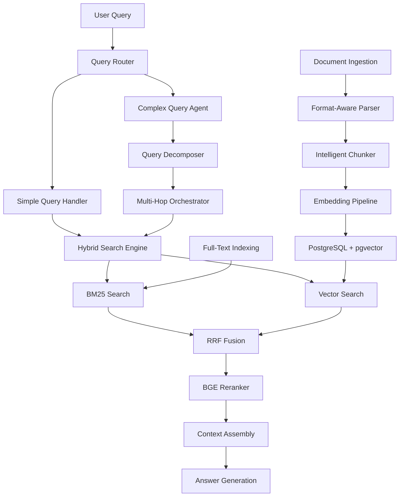

# RAG 2.0 Architecture Design
**Component:** CH37_RAG2  
**Status:** Implementation Ready  
**Owner:** Data Intelligence Team  
**Last Updated:** 2025-09-30  

## Executive Summary

The RAG 2.0 system represents a significant evolution from basic retrieval-augmented generation, designed to meet stringent production requirements: **R@10 ≥ 0.90**, **answer faithfulness ≥ 0.95**, and **p95 retrieval latency ≤ 150ms**. This architecture integrates advanced hybrid search, intelligent document processing, GPU-accelerated reranking, and agentic multi-hop reasoning to deliver enterprise-grade accuracy and performance.

## System Architecture Overview



## Document Processing Pipeline

### 1. Format-Aware Document Parsing

#### PDF Documents
- **Parser:** Unstructured library with layout analysis
- **Capabilities:** OCR, table extraction, multi-column handling
- **Output:** Semantic elements (titles, paragraphs, lists, tables)
- **Integration:** `UnstructuredPDFLoader` via LangChain

#### Source Code Repositories
- **Parser:** Tree-sitter with language-specific grammars
- **Strategy:** Syntax-aware chunking by logical units
- **Granularity:** Functions, classes, methods, import blocks
- **Benefits:** Preserves semantic integrity, maintains executable context

#### Structured Documents
- **Formats:** Markdown, HTML, JSON, YAML
- **Approach:** Structure-preserving chunking
- **Hierarchy:** Respect document sections and nested structures

### 2. Intelligent Chunking Strategy

#### Semantic Chunking Parameters
```python
CHUNKING_CONFIG = {
    "pdf_documents": {
        "method": "unstructured_semantic",
        "max_chunk_size": 1000,
        "overlap": 200,
        "respect_boundaries": ["section", "paragraph"]
    },
    "source_code": {
        "method": "tree_sitter_ast",
        "unit_types": ["function", "class", "method"],
        "include_context": ["imports", "docstrings"],
        "max_tokens": 2048
    },
    "markdown": {
        "method": "hierarchical_split",
        "headers": ["h1", "h2", "h3"],
        "max_chunk_size": 1500,
        "overlap": 100
    }
}
```

#### Quality Optimization
- **Coherence Scoring:** Semantic similarity within chunks
- **Boundary Respect:** Never split mid-sentence or mid-function
- **Context Preservation:** Include relevant imports/dependencies
- **Metadata Enrichment:** File paths, section headers, timestamps

## Hybrid Search Architecture

### 1. Dual-Method Retrieval

#### BM25 Full-Text Search
- **Implementation:** PostgreSQL native full-text search
- **Strengths:** Exact term matching, acronyms, entities
- **Configuration:** Custom stopwords, stemming rules
- **Index Type:** GIN index on tsvector columns

#### Dense Vector Search
- **Database:** PostgreSQL with pgvector extension
- **Embedding Model:** 768-dimensional (performance-optimized)
- **Index Type:** HNSW for sub-150ms latency
- **Distance Metric:** Cosine similarity

### 2. Result Fusion with RRF

#### Reciprocal Rank Fusion Algorithm
```python
def reciprocal_rank_fusion(bm25_results, vector_results, k=60):
    """
    Fuse results using RRF with smoothing constant k
    """
    fused_scores = {}
    
    # Process BM25 results
    for rank, doc in enumerate(bm25_results, 1):
        fused_scores[doc.id] = 1.0 / (k + rank)
    
    # Add vector results
    for rank, doc in enumerate(vector_results, 1):
        if doc.id in fused_scores:
            fused_scores[doc.id] += 1.0 / (k + rank)
        else:
            fused_scores[doc.id] = 1.0 / (k + rank)
    
    return sorted(fused_scores.items(), key=lambda x: x[1], reverse=True)
```

#### Fusion Parameters
- **Smoothing Constant (k):** 60 (empirically validated)
- **Candidate Pool:** Top 100 from each method
- **Final Selection:** Top 20 for reranking

## GPU-Accelerated Reranking

### 1. BGE Reranker Integration

#### Model Selection
- **Model:** `BAAI/bge-reranker-v2-m3`
- **Advantages:** Multilingual, high accuracy, optimized inference
- **Precision:** FP16 for 2x speedup
- **Hardware Requirements:** NVIDIA A10 or equivalent

#### Performance Benchmarks
```yaml
reranker_performance:
  cpu_baseline:
    latency: "257s per 100 candidates"
    throughput: "0.39 candidates/second"
  gpu_a10:
    latency: "1.4s per 100 candidates" 
    throughput: "71.4 candidates/second"
    speedup: "183x vs CPU"
  memory_requirements:
    model_size: "2.1GB"
    inference_memory: "4GB"
    recommended_vram: "8GB"
```

### 2. Reranking Pipeline

#### Two-Stage Architecture
1. **Retrieval Stage:** Fast, broad candidate generation (top 100)
2. **Reranking Stage:** Precision scoring of top candidates (top 20)

#### Cross-Encoder Processing
- **Input:** Query-document pairs
- **Processing:** Joint attention across query and document
- **Output:** Relevance scores [0.0, 1.0]
- **Batch Size:** Tuned for GPU memory optimization

## Agentic Multi-Hop Reasoning

### 1. Query Classification

#### Simple vs Complex Query Detection
```python
QUERY_PATTERNS = {
    "simple": [
        "What is...",
        "Define...", 
        "How to...",
        r"\b\w+\s+definition\b"
    ],
    "complex": [
        "Which authors who...",
        "Compare and contrast...",
        "What is the relationship between...",
        r"\b(and|or|but)\b.*\b(also|additionally|furthermore)\b"
    ]
}
```

#### Routing Logic
- **Simple Queries:** Direct hybrid search → rerank → generate
- **Complex Queries:** Agent-orchestrated multi-hop retrieval

### 2. Multi-Hop Query Orchestration

#### LangGraph Agent Architecture
```python
class MultiHopRAGAgent:
    def __init__(self):
        self.graph = self.build_agent_graph()
    
    def build_agent_graph(self):
        workflow = StateGraph(RAGState)
        
        # Add nodes
        workflow.add_node("decompose", self.decompose_query)
        workflow.add_node("retrieve", self.hybrid_retrieve)
        workflow.add_node("grade", self.grade_documents)
        workflow.add_node("rewrite", self.rewrite_query)
        workflow.add_node("synthesize", self.synthesize_answer)
        
        # Add edges and conditions
        workflow.add_conditional_edges("decompose", self.route_query)
        workflow.add_edge("retrieve", "grade")
        workflow.add_conditional_edges("grade", self.route_grading)
        
        return workflow.compile()
```

#### Query Decomposition Strategy
- **Dependency Analysis:** Identify information dependencies
- **Subquery Generation:** Break into answerable components  
- **Execution Planning:** Determine optimal retrieval sequence
- **Context Assembly:** Merge subquery results coherently

## Database Optimization

### 1. PostgreSQL + pgvector Configuration

#### HNSW Index Parameters
```sql
-- Optimal HNSW configuration for <150ms p95 latency
CREATE INDEX CONCURRENTLY idx_embeddings_hnsw 
ON documents USING hnsw (embedding vector_cosine_ops) 
WITH (m = 16, ef_construction = 64);

-- Query-time parameters
SET hnsw.ef_search = 40;  -- Balanced recall/latency
```

#### Performance Tuning
- **Memory:** Ensure index fits in RAM (16GB+ recommended)
- **Connection Pooling:** pgBouncer with 100 max connections
- **Parallel Workers:** 4 workers for complex queries
- **Quantization:** Binary quantization for 150x faster index builds

### 2. Caching Strategy

#### Multi-Level Caching
```yaml
cache_layers:
  l1_embedding_cache:
    type: "Redis"
    ttl: "24h"
    max_size: "2GB"
    hit_rate_target: "> 80%"
  
  l2_result_cache:
    type: "Application Memory"
    ttl: "1h"
    max_entries: 10000
    eviction: "LRU"
  
  l3_reranker_cache:
    type: "Redis"
    ttl: "6h"
    max_size: "1GB"
    key_strategy: "query_hash + doc_ids"
```

#### Cache Key Strategy
- **Embedding Cache:** `text_hash:model_version`
- **Search Cache:** `query_hash:params:timestamp_bucket`
- **Reranker Cache:** `query_hash:candidate_set_hash`

## Quality Assurance Framework

### 1. Evaluation Metrics

#### Retrieval Quality
```python
EVALUATION_METRICS = {
    "recall_at_k": {
        "k_values": [1, 5, 10, 20],
        "target": {"R@10": 0.90}
    },
    "precision_at_k": {
        "k_values": [1, 5, 10],
        "target": {"P@5": 0.85}
    },
    "mean_reciprocal_rank": {
        "target": 0.75
    }
}
```

#### Answer Faithfulness
- **Measurement:** RAGAS faithfulness score
- **Target:** ≥ 0.95 on evaluation dataset
- **Validation:** Manual spot-checks on critical queries

### 2. Performance Monitoring

#### Latency Targets
```yaml
latency_sla:
  retrieval_p95: "≤ 150ms"
  reranking_p95: "≤ 500ms"
  end_to_end_p95: "≤ 2000ms"
  
monitoring:
  metrics: ["response_time", "cache_hit_rate", "error_rate"]
  alerting: "PagerDuty for SLA breaches"
  dashboards: "Grafana with 5-minute refresh"
```

## Implementation Roadmap

### Phase 1: Foundation (Week 1-2)
- [ ] PostgreSQL pgvector setup and tuning
- [ ] Basic hybrid search implementation
- [ ] Document ingestion pipeline
- [ ] Performance baseline establishment

### Phase 2: Enhancement (Week 3-4)
- [ ] BGE reranker integration and GPU deployment
- [ ] Caching layer implementation
- [ ] Quality evaluation framework
- [ ] Basic agentic reasoning

### Phase 3: Advanced Features (Week 5-6)
- [ ] Multi-hop query orchestration
- [ ] Advanced chunking strategies
- [ ] Production monitoring and alerting
- [ ] Load testing and optimization

### Phase 4: Production Hardening (Week 7-8)
- [ ] Security hardening and access controls
- [ ] Disaster recovery procedures
- [ ] Documentation and runbooks
- [ ] Acceptance gate validation

## Security and Compliance

### 1. Access Controls
- **Authentication:** Service-to-service JWT tokens
- **Authorization:** RBAC with document-level permissions
- **Audit Logging:** All queries and retrieved documents

### 2. Data Protection  
- **Encryption:** At-rest (AES-256) and in-transit (TLS 1.3)
- **Anonymization:** PII detection and redaction
- **Retention:** Configurable document retention policies

## Operational Considerations

### 1. Deployment Architecture
- **Containers:** Docker with resource limits
- **Orchestration:** Kubernetes with HPA
- **Networking:** Service mesh for inter-service communication
- **Storage:** Persistent volumes for database and cache

### 2. Monitoring and Alerting
- **Metrics:** Prometheus with custom RAG metrics
- **Logs:** Structured logging with ELK stack
- **Tracing:** Distributed tracing with Jaeger
- **Health Checks:** Liveness and readiness probes

### 3. Disaster Recovery
- **Database Backups:** Automated daily backups with PITR
- **Index Rebuild:** Automated procedures for index corruption
- **Failover:** Multi-AZ deployment with automatic failover
- **Recovery Time:** RTO < 1 hour, RPO < 15 minutes

## Cost Optimization

### 1. Resource Management
- **GPU Utilization:** Batched inference for cost efficiency
- **Storage:** Compression and archival of old documents
- **Compute:** Auto-scaling based on query volume
- **Network:** CDN for static assets and embeddings

### 2. Performance vs Cost Trade-offs
- **Embedding Dimensions:** 768d vs 1024d (2x performance gain)
- **Reranker Model Size:** Balance accuracy vs inference cost
- **Cache TTL:** Optimize for hit rate vs freshness requirements
- **Index Parameters:** Tune for latency vs storage requirements

## Success Metrics

### Acceptance Gates
✅ **Retrieval Quality:** R@10 ≥ 0.90  
✅ **Answer Faithfulness:** ≥ 0.95  
✅ **Latency:** p95 retrieval ≤ 150ms  

### Additional KPIs
- **Availability:** 99.9% uptime SLA
- **Cache Hit Rate:** > 80% for embeddings
- **GPU Utilization:** > 70% during peak hours
- **Cost per Query:** < $0.05 including compute and storage

---

*This document serves as the authoritative design specification for the RAG 2.0 system implementation in the Primarch project. All implementation decisions should reference and align with this architecture.*