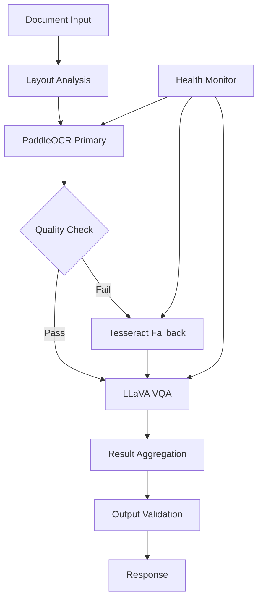

# Vision Ingestion Pipeline Runbook

## Overview

This runbook covers the operational procedures for Primarch's vision ingestion pipeline, including OCR (PaddleOCR), Document VQA (LLaVA), and Layout Analysis (LayoutParser) components.

## Architecture Overview



## Component Status Dashboard

### Quick Health Check
```bash
# Overall pipeline health
curl -s http://vision-api:8080/health | jq '.'

# Individual component status
curl -s http://vision-api:8080/ocr/health
curl -s http://vision-api:8080/vqa/health
curl -s http://vision-api:8080/layout/health
```

### Expected Response
```json
{
  "status": "healthy",
  "components": {
    "paddleocr": "online",
    "llava": "online", 
    "layout_parser": "online",
    "tesseract_fallback": "online"
  },
  "resource_usage": {
    "gpu_memory_used": "12.4GB",
    "cpu_usage": "45%"
  }
}
```

## Deployment Procedures

### Initial Deployment

```bash
# 1. Create namespace
kubectl create namespace primarch-vision

# 2. Deploy models and configs
kubectl apply -f k8s/vision-pipeline/

# 3. Verify deployment
kubectl get pods -n primarch-vision
kubectl logs -f deployment/paddle-ocr -n primarch-vision
kubectl logs -f deployment/llava-vqa -n primarch-vision

# 4. Run smoke tests
./scripts/vision-smoke-test.sh
```

### Rolling Update Procedure

```bash
# 1. Update container images
kubectl set image deployment/paddle-ocr paddle-ocr=paddle:2.7.1 -n primarch-vision

# 2. Monitor rollout
kubectl rollout status deployment/paddle-ocr -n primarch-vision

# 3. Validate functionality
./scripts/validate-vision-update.sh

# 4. Rollback if needed
kubectl rollout undo deployment/paddle-ocr -n primarch-vision
```

## Monitoring & Alerting

### Key Performance Indicators

| Metric | Threshold | Action |
|--------|-----------|---------|
| OCR p95 latency | >3.5s | Scale up PaddleOCR pods |
| VQA p95 latency | >5s | Scale up LLaVA pods |
| Error rate | >5% | Investigate + activate fallback |
| GPU memory usage | >85% | Scale horizontally |
| OCR confidence | <0.8 avg | Check input quality |

### Grafana Queries

**OCR Processing Time:**
```promql
histogram_quantile(0.95, 
  rate(primarch_ocr_duration_seconds_bucket[5m])
) * 1000
```

**VQA Success Rate:**
```promql
rate(primarch_vqa_requests_total{status="success"}[5m]) /
rate(primarch_vqa_requests_total[5m]) * 100
```

**GPU Utilization:**
```promql
nvidia_gpu_memory_used_bytes / nvidia_gpu_memory_total_bytes * 100
```

### Alert Conditions

```yaml
# High OCR Latency
- alert: HighOCRLatency
  expr: histogram_quantile(0.95, rate(primarch_ocr_duration_seconds_bucket[5m])) > 3.5
  for: 2m
  annotations:
    summary: "OCR processing latency is high"
    runbook: "https://wiki/runbooks/vision-ingest#high-ocr-latency"

# VQA Model Failure
- alert: VQAModelDown
  expr: up{job="llava-vqa"} == 0
  for: 1m
  annotations:
    summary: "LLaVA VQA model is down"
    runbook: "https://wiki/runbooks/vision-ingest#vqa-model-failure"

# GPU Memory Exhaustion
- alert: GPUMemoryHigh
  expr: nvidia_gpu_memory_used_bytes / nvidia_gpu_memory_total_bytes > 0.9
  for: 2m
  annotations:
    summary: "GPU memory usage is critically high"
```

## Troubleshooting Guide

### Common Issues

#### 1. High OCR Latency (>3.5s p95)

**Symptoms:**
- Slow document processing
- User complaints about response time
- OCR queue building up

**Investigation Steps:**
```bash
# Check current performance
kubectl exec -it deploy/paddle-ocr -- nvidia-smi
kubectl top pods -n primarch-vision

# Review recent logs
kubectl logs --tail=100 deploy/paddle-ocr | grep -E "(ERROR|WARN|processing_time)"

# Check input queue
curl -s http://vision-api:8080/metrics | grep ocr_queue_size
```

**Resolution:**
1. **Scale horizontally:**
   ```bash
   kubectl scale deployment paddle-ocr --replicas=6 -n primarch-vision
   ```

2. **Enable batch processing:**
   ```bash
   kubectl patch deployment paddle-ocr -p '{"spec":{"template":{"spec":{"containers":[{"name":"paddle-ocr","env":[{"name":"BATCH_SIZE","value":"8"}]}]}}}}'
   ```

3. **Activate CPU fallback:**
   ```bash
   kubectl patch configmap vision-config --patch '{"data":{"FALLBACK_ENABLED":"true"}}'
   ```

#### 2. VQA Model Failure

**Symptoms:**
- VQA endpoints returning 5xx errors
- Model loading failures in logs
- GPU out of memory errors

**Investigation Steps:**
```bash
# Check model status
kubectl describe pod -l app=llava-vqa -n primarch-vision

# Review GPU memory
kubectl exec -it deploy/llava-vqa -- nvidia-smi

# Check model files
kubectl exec -it deploy/llava-vqa -- ls -la /models/llava-onevision-8b/
```

**Resolution:**
1. **Restart model pods:**
   ```bash
   kubectl delete pods -l app=llava-vqa -n primarch-vision
   ```

2. **Reduce batch size:**
   ```bash
   kubectl patch deployment llava-vqa -p '{"spec":{"template":{"spec":{"containers":[{"name":"llava-vqa","env":[{"name":"MAX_BATCH_SIZE","value":"2"}]}]}}}}'
   ```

3. **Switch to smaller model:**
   ```bash
   kubectl patch deployment llava-vqa -p '{"spec":{"template":{"spec":{"containers":[{"name":"llava-vqa","image":"llava-onevision:8b-quantized"}]}}}}'
   ```

#### 3. Layout Parser Accuracy Issues

**Symptoms:**
- Poor table detection results
- Missing document structure elements
- User reports of incorrect parsing

**Investigation Steps:**
```bash
# Check model confidence scores
curl -s http://vision-api:8080/layout/metrics | grep confidence

# Review recent parsing results
kubectl logs deploy/layout-parser | grep -A 5 "low_confidence"

# Validate input image quality
curl -X POST http://vision-api:8080/layout/validate \
  -H "Content-Type: application/json" \
  -d '{"image": "base64_data_here"}'
```

**Resolution:**
1. **Lower detection threshold:**
   ```bash
   kubectl patch configmap layout-config --patch '{"data":{"DETECTION_THRESHOLD":"0.6"}}'
   ```

2. **Enable preprocessing:**
   ```bash
   kubectl patch configmap layout-config --patch '{"data":{"ENABLE_PREPROCESSING":"true"}}'
   ```

3. **Switch to backup model:**
   ```bash
   kubectl patch deployment layout-parser -p '{"spec":{"template":{"spec":{"containers":[{"name":"layout-parser","image":"layout-parser:backup-model"}]}]}}'
   ```

### Emergency Procedures

#### Complete Pipeline Failure

```bash
# 1. Activate emergency fallback
kubectl apply -f k8s/emergency/tesseract-only-mode.yaml

# 2. Notify stakeholders
curl -X POST https://hooks.slack.com/... \
  -d '{"text": "🚨 Vision pipeline in emergency mode - OCR only"}'

# 3. Scale up fallback resources
kubectl scale deployment tesseract-fallback --replicas=10 -n primarch-vision

# 4. Monitor recovery
watch kubectl get pods -n primarch-vision
```

#### GPU Node Failure

```bash
# 1. Cordon failing nodes
kubectl cordon gpu-node-01

# 2. Drain workloads
kubectl drain gpu-node-01 --ignore-daemonsets --delete-emptydir-data

# 3. Verify rescheduling
kubectl get pods -n primarch-vision -o wide

# 4. Update node pool if needed
gcloud container node-pools resize vision-gpu-pool --num-nodes=4
```

## Performance Optimization

### GPU Memory Optimization

```bash
# Enable model quantization
kubectl patch deployment llava-vqa -p '{"spec":{"template":{"spec":{"containers":[{"name":"llava-vqa","env":[{"name":"QUANTIZATION","value":"int8"}]}]}}}}'

# Use gradient checkpointing
kubectl patch deployment llava-vqa -p '{"spec":{"template":{"spec":{"containers":[{"name":"llava-vqa","env":[{"name":"GRADIENT_CHECKPOINTING","value":"true"}]}]}}}}'
```

### Batch Processing Configuration

```bash
# Optimal batch sizes (adjust based on GPU memory)
# PaddleOCR: 8-16 images
kubectl patch configmap paddle-config --patch '{"data":{"BATCH_SIZE":"12"}}'

# LLaVA: 2-4 documents (memory intensive)
kubectl patch configmap llava-config --patch '{"data":{"BATCH_SIZE":"3"}}'
```

### Caching Strategy

```bash
# Enable result caching (Redis)
kubectl apply -f k8s/caching/redis-cluster.yaml

# Configure cache TTL
kubectl patch configmap vision-config --patch '{"data":{"CACHE_TTL":"3600"}}'
```

## Maintenance Procedures

### Model Updates

```bash
# 1. Download new model
gsutil cp gs://primarch-models/paddleocr-v2.8.0.tar.gz /tmp/

# 2. Create new ConfigMap
kubectl create configmap paddle-model-v28 --from-file=/tmp/paddleocr-v2.8.0.tar.gz

# 3. Update deployment
kubectl patch deployment paddle-ocr -p '{"spec":{"template":{"spec":{"volumes":[{"name":"model","configMap":{"name":"paddle-model-v28"}}]}}}}'

# 4. Verify model loading
kubectl logs -f deploy/paddle-ocr | grep "model_loaded"
```

### Database Cleanup

```bash
# Clean old processing logs (keep 30 days)
kubectl exec -it postgres-0 -- psql -c "DELETE FROM vision_logs WHERE created_at < NOW() - INTERVAL '30 days';"

# Clean cached results (keep 7 days)
kubectl exec -it redis-0 -- redis-cli EVAL "
  for i, name in ipairs(redis.call('KEYS', 'vision:*')) do
    if redis.call('TTL', name) < 0 then
      redis.call('DEL', name)
    end
  end
" 0
```

### Performance Baselines

#### Weekly Performance Report

```bash
#!/bin/bash
# Generate performance report
cat << EOF > weekly-report.sql
SELECT 
  DATE_TRUNC('day', created_at) as date,
  AVG(processing_time_ms) as avg_latency,
  PERCENTILE_CONT(0.95) WITHIN GROUP (ORDER BY processing_time_ms) as p95_latency,
  COUNT(*) as total_requests,
  COUNT(*) FILTER (WHERE success = true) as successful_requests
FROM vision_processing_log 
WHERE created_at >= NOW() - INTERVAL '7 days'
GROUP BY DATE_TRUNC('day', created_at)
ORDER BY date;
EOF

kubectl exec -it postgres-0 -- psql -f weekly-report.sql
```

## Security Considerations

### Input Validation

```python
# Validate image format and size
def validate_input(image_data):
    if len(image_data) > MAX_IMAGE_SIZE:
        raise ValueError("Image too large")
    
    # Check for malicious content
    if not is_safe_image(image_data):
        raise SecurityError("Potentially malicious image")
```

### PII Detection

```bash
# Enable PII scanning
kubectl patch configmap vision-config --patch '{"data":{"PII_DETECTION":"true"}}'

# Review PII alerts
kubectl logs deploy/vision-api | grep "PII_DETECTED"
```

### Network Security

```bash
# Verify network policies
kubectl get networkpolicies -n primarch-vision

# Test connectivity
kubectl exec -it test-pod -- nc -zv llava-vqa 8080
```

## Capacity Planning

### Resource Requirements by Load

| Daily Requests | PaddleOCR Pods | LLaVA Pods | GPU Nodes | Estimated Cost/Day |
|----------------|----------------|------------|-----------|-------------------|
| 1,000 | 2 | 2 | 1 | $48 |
| 10,000 | 4 | 4 | 2 | $96 |
| 50,000 | 8 | 6 | 3 | $144 |
| 100,000 | 12 | 8 | 4 | $192 |

### Scaling Thresholds

```yaml
# HorizontalPodAutoscaler for PaddleOCR
apiVersion: autoscaling/v2
kind: HorizontalPodAutoscaler
metadata:
  name: paddle-ocr-hpa
spec:
  scaleTargetRef:
    apiVersion: apps/v1
    kind: Deployment
    name: paddle-ocr
  minReplicas: 2
  maxReplicas: 15
  metrics:
  - type: Resource
    resource:
      name: cpu
      target:
        type: Utilization
        averageUtilization: 70
```

## Contact Information

- **On-call Engineer**: vision-oncall@primarch.ai
- **Slack Channel**: #primarch-vision-ops
- **Escalation**: platform-team@primarch.ai
- **Documentation**: https://docs.primarch.ai/vision-pipeline

## Changelog

| Version | Date | Changes |
|---------|------|---------|
| 1.0 | 2025-09-30 | Initial runbook creation |
| 1.1 | TBD | GPU optimization procedures |
| 1.2 | TBD | Multi-region deployment guide |
