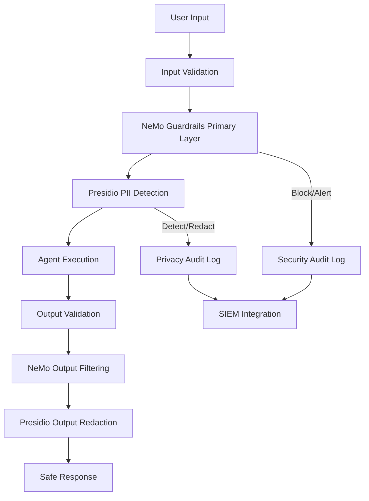

# Second Layer Security - Guardrails Implementation

## Executive Summary

**Selected Stack**: NeMo Guardrails (Primary) + Presidio (Auxiliary)

**Rationale**: NeMo Guardrails provides comprehensive multi-type protection with 89% accuracy in input moderation, while Presidio offers specialized PII detection with tunable precision/recall. This combination delivers defense-in-depth against prompt injection, jailbreaking, data leakage, and privacy violations.

**Target Performance**: False Positive Rate < 5%, False Negative Rate (PII) < 1%

## Architecture Overview

### Two-Layer Defense Strategy



### Layer Responsibilities

**Layer 1 - NeMo Guardrails (Primary)**
- Jailbreak attempt detection and prevention
- Prompt injection filtering  
- Topic control and conversation flow management
- Content moderation (toxicity, bias, inappropriate content)
- Execution rails for tool/API security
- Dialog rails for conversational safety

**Layer 2 - Presidio (Auxiliary)**  
- PII detection and classification (names, emails, SSN, etc.)
- Data anonymization and pseudonymization
- Regulatory compliance (GDPR, HIPAA, CCPA)
- Sensitive data redaction in logs and outputs
- Precision-tuned recognizers for domain-specific data

## Implementation Architecture

### Request Flow Processing

```python
class SecondLayerGuardrails:
    def __init__(self):
        self.nemo = NeMoGuardrailsEngine()
        self.presidio = PresidioEngine()
        self.metrics = GuardrailsMetrics()
    
    async def process_request(self, request: AgentRequest) -> GuardrailResult:
        """Multi-layer security processing"""
        
        # Layer 1: NeMo Primary Filtering
        nemo_result = await self.nemo.validate_input(
            text=request.input,
            context=request.context,
            policies=self.get_route_policies(request.route)
        )
        
        if nemo_result.action == "BLOCK":
            self.metrics.increment_blocked("nemo", nemo_result.violation_type)
            return GuardrailResult(
                action="BLOCK",
                reason=nemo_result.reason,
                layer="nemo_primary"
            )
        
        # Layer 2: Presidio PII Detection
        presidio_result = await self.presidio.analyze_pii(
            text=request.input,
            config=self.get_pii_config(request.route)
        )
        
        if presidio_result.has_pii:
            # Redact or block based on policy
            if presidio_result.risk_level == "HIGH":
                self.metrics.increment_blocked("presidio", "high_risk_pii")
                return GuardrailResult(
                    action="BLOCK", 
                    reason="High-risk PII detected",
                    layer="presidio_auxiliary"
                )
            else:
                # Redact and continue
                request.input = presidio_result.redacted_text
                self.metrics.increment_redacted("presidio", "pii_redaction")
        
        # Both layers passed - continue processing
        return GuardrailResult(
            action="ALLOW",
            modified_input=request.input,
            warnings=nemo_result.warnings + presidio_result.warnings
        )
```

### Route-Specific Configuration

```yaml
# Route-based security profiles
routes:
  /v1/agents/execute:
    nemo_guardrails:
      input_rails:
        - jailbreak_detection: strict
        - prompt_injection: strict  
        - topic_control: ["safe_topics"]
        - content_moderation: high
      output_rails:
        - hallucination_filter: medium
        - bias_detection: enabled
        - toxicity_filter: strict
    presidio:
      pii_detection: high_recall
      redaction_strategy: pseudonymize
      entities: ["PERSON", "EMAIL", "PHONE", "SSN", "CREDIT_CARD"]
      
  /v1/rag/query:
    nemo_guardrails:
      retrieval_rails:
        - source_validation: enabled
        - fact_checking: basic
      output_rails:
        - hallucination_filter: strict
    presidio:
      pii_detection: medium_precision  
      redaction_strategy: redact
      entities: ["PERSON", "EMAIL", "PHONE"]
```

## NeMo Guardrails Configuration

### Core Security Rails

```python
# Input Rails - First Line of Defense
INPUT_RAILS = {
    "jailbreak_detection": {
        "enabled": True,
        "model": "jailbreak_classifier",
        "threshold": 0.8,
        "action": "block",
        "message": "Security violation detected"
    },
    
    "prompt_injection": {
        "enabled": True,
        "patterns": [
            r"ignore previous instructions",
            r"system:\s*you are now",
            r"\/\*.*\*\/.*new instructions",
            r"<script>.*</script>"
        ],
        "action": "block"
    },
    
    "topic_control": {
        "allowed_topics": [
            "software_development",
            "data_analysis", 
            "technical_support",
            "general_knowledge"
        ],
        "blocked_topics": [
            "harmful_content",
            "illegal_activities",
            "personal_attacks",
            "medical_advice"
        ]
    }
}

# Dialog Rails - Conversation Flow Control  
DIALOG_RAILS = {
    "max_turns": 50,
    "escalation_triggers": [
        "repeated_violations",
        "aggressive_language",
        "system_prompt_requests"
    ],
    "human_handoff": {
        "enabled": True,
        "conditions": ["high_risk_detected", "user_complaint"]
    }
}

# Output Rails - Response Filtering
OUTPUT_RAILS = {
    "content_filters": [
        "toxicity_classifier",
        "bias_detector", 
        "hallucination_checker"
    ],
    "pii_scrubbing": {
        "enabled": True,
        "integration": "presidio"
    },
    "fact_checking": {
        "enabled": True,
        "confidence_threshold": 0.7
    }
}
```

### Custom Security Actions

```python
from nemo_guardrails.actions import action

@action(is_system_action=True)
async def security_audit_log(events):
    """Log security events for monitoring"""
    for event in events:
        await audit_logger.log_security_event(
            violation_type=event.violation_type,
            user_id=event.user_id,
            trace_id=event.trace_id,
            severity=event.severity,
            blocked=event.blocked
        )

@action(is_system_action=True)  
async def escalate_to_human(events):
    """Escalate high-risk interactions to human review"""
    for event in events:
        if event.risk_level == "HIGH":
            await human_review_queue.add_case(
                case_id=event.trace_id,
                user_input=event.sanitized_input,
                violation_details=event.details,
                priority="immediate"
            )
```

## Presidio PII Configuration

### High-Precision Recognizer Tuning

```python
from presidio_analyzer import AnalyzerEngine, RecognizerRegistry
from presidio_analyzer.predefined_recognizers import CreditCardRecognizer
from presidio_anonymizer import AnonymizerEngine

class TunedPresidioEngine:
    def __init__(self):
        # Custom recognizer registry with tuned precision/recall
        self.registry = RecognizerRegistry()
        
        # Tune credit card recognizer for higher precision
        cc_recognizer = CreditCardRecognizer()
        cc_recognizer.context = ["payment", "card", "credit", "visa", "mastercard"]
        self.registry.add_recognizer(cc_recognizer)
        
        # Custom name recognizer with domain-specific training
        self.registry.add_recognizer(EnhancedNameRecognizer(
            confidence_threshold=0.85,
            context_enhancement=True
        ))
        
        self.analyzer = AnalyzerEngine(registry=self.registry)
        self.anonymizer = AnonymizerEngine()
    
    async def analyze_with_tuning(self, text: str, route: str) -> PIIResult:
        """Analyze text with route-specific tuning"""
        
        config = self.get_route_config(route)
        
        # Analyze with tuned recognizers
        results = self.analyzer.analyze(
            text=text,
            entities=config.entities,
            language="en",
            score_threshold=config.confidence_threshold
        )
        
        # Apply verifier models for false positive reduction
        if config.enable_verification:
            results = await self.verify_detections(text, results)
        
        return PIIResult(
            entities_found=results,
            risk_level=self.calculate_risk_level(results),
            recommended_action=self.get_recommended_action(results, config)
        )

    def get_route_config(self, route: str) -> PIIConfig:
        """Route-specific PII detection configuration"""
        configs = {
            "/v1/agents/execute": PIIConfig(
                entities=["PERSON", "EMAIL", "PHONE", "SSN", "CREDIT_CARD"],
                confidence_threshold=0.8,  # Higher recall for agent execution
                enable_verification=True,
                redaction_strategy="pseudonymize"
            ),
            "/v1/rag/query": PIIConfig(
                entities=["PERSON", "EMAIL", "PHONE"],
                confidence_threshold=0.9,  # Higher precision for RAG
                enable_verification=True,
                redaction_strategy="redact"
            )
        }
        return configs.get(route, self.default_config)
```

### Precision/Recall Optimization

```python
class PIIPerformanceTuner:
    """Optimize PII detection for target FP<5%, FN<1%"""
    
    def __init__(self):
        self.target_fpr = 0.05  # Max 5% false positive rate
        self.target_fnr_pii = 0.01  # Max 1% false negative rate for PII
        
    async def tune_recognizers(self, labeled_dataset: PIIDataset):
        """Iterative tuning using evaluation dataset"""
        
        for recognizer in self.recognizers:
            best_config = None
            best_f2_score = 0  # F2 emphasizes recall
            
            for threshold in np.arange(0.5, 1.0, 0.05):
                for context_window in [5, 10, 15, 20]:
                    config = RecognizerConfig(
                        confidence_threshold=threshold,
                        context_window=context_window
                    )
                    
                    metrics = await self.evaluate_config(
                        recognizer, config, labeled_dataset
                    )
                    
                    # Prioritize recall while keeping FPR under 5%
                    if (metrics.fpr < self.target_fpr and 
                        metrics.fnr < self.target_fnr_pii and
                        metrics.f2_score > best_f2_score):
                        
                        best_config = config
                        best_f2_score = metrics.f2_score
            
            if best_config:
                self.apply_config(recognizer, best_config)
                await self.log_tuning_results(recognizer, best_config, metrics)
```

## Security Policies Implementation

### Policy Engine Integration

```python
class GuardrailPolicyEngine:
    def __init__(self):
        self.policies = self.load_policies("/srv/primarch/safety/guardrail_policies.yaml")
        self.nemo = NeMoGuardrailsEngine()
        self.presidio = TunedPresidioEngine()
    
    async def enforce_policies(self, request: AgentRequest) -> PolicyResult:
        """Enforce multi-layer security policies"""
        
        route_policy = self.policies.get_route_policy(request.route)
        violations = []
        
        # NeMo Guardrails Policy Enforcement
        if route_policy.nemo_enabled:
            nemo_result = await self.nemo.check_violations(
                input=request.input,
                rules=route_policy.nemo_rules
            )
            violations.extend(nemo_result.violations)
        
        # Presidio PII Policy Enforcement  
        if route_policy.presidio_enabled:
            pii_result = await self.presidio.check_pii_violations(
                input=request.input,
                config=route_policy.presidio_config
            )
            violations.extend(pii_result.violations)
        
        # Determine final action based on violation severity
        final_action = self.determine_action(violations, route_policy)
        
        return PolicyResult(
            action=final_action,
            violations=violations,
            modified_input=self.apply_mitigations(request.input, violations)
        )
```

## Monitoring & Observability

### Real-time Metrics Dashboard

```yaml
# Guardrails Performance Monitoring
guardrails_metrics:
  - name: guardrails_requests_total
    type: counter
    labels: [layer, route, action]
    
  - name: guardrails_violations_total  
    type: counter
    labels: [layer, violation_type, severity]
    
  - name: guardrails_false_positive_rate
    type: gauge
    labels: [layer, recognizer]
    target: < 0.05
    
  - name: guardrails_false_negative_rate_pii
    type: gauge  
    labels: [entity_type]
    target: < 0.01
    
  - name: guardrails_latency_seconds
    type: histogram
    labels: [layer, operation]
    buckets: [0.01, 0.05, 0.1, 0.25, 0.5, 1.0, 2.5, 5.0]
    
  - name: guardrails_confidence_score
    type: histogram
    labels: [layer, recognizer]
```

### Alert Thresholds

```yaml
alerts:
  - name: HighFalsePositiveRate
    condition: guardrails_false_positive_rate > 0.05
    severity: warning
    runbook: "Tune recognizer thresholds to reduce false positives"
    
  - name: PIIFalseNegativeRate  
    condition: guardrails_false_negative_rate_pii > 0.01
    severity: critical
    runbook: "Immediate review of PII detection - potential privacy breach risk"
    
  - name: SecurityViolationSpike
    condition: rate(guardrails_violations_total[5m]) > 10
    severity: warning
    runbook: "Investigate potential attack pattern"
    
  - name: GuardrailsLatencyHigh
    condition: guardrails_latency_seconds{quantile="0.95"} > 2.0
    severity: warning
    runbook: "Performance degradation in guardrails processing"
```

## Performance Targets & SLAs

### Service Level Objectives

| Metric | Target | Measurement |
|--------|--------|-------------|
| False Positive Rate | < 5% | Weekly evaluation on validation set |
| False Negative Rate (PII) | < 1% | Daily evaluation on PII test cases |
| Processing Latency P95 | < 200ms | Real-time monitoring |
| Availability | 99.95% | Monthly uptime calculation |
| Threat Detection Accuracy | > 89% | Weekly security evaluation |

### Resource Allocation

```yaml
resources:
  nemo_guardrails:
    cpu_limit: "2000m"
    memory_limit: "4Gi" 
    replicas: 3
    
  presidio_engine:
    cpu_limit: "1000m"
    memory_limit: "2Gi"
    replicas: 2
    
  policy_engine:
    cpu_limit: "500m" 
    memory_limit: "1Gi"
    replicas: 2
```

## Deployment & Integration

### Kubernetes Deployment

```yaml
apiVersion: apps/v1
kind: Deployment
metadata:
  name: guardrails-service
spec:
  replicas: 3
  template:
    spec:
      containers:
      - name: nemo-guardrails
        image: primarch/nemo-guardrails:v1.0
        resources:
          requests:
            cpu: 1000m
            memory: 2Gi
          limits:
            cpu: 2000m
            memory: 4Gi
        env:
        - name: NEMO_CONFIG_PATH
          value: "/config/nemo_config.yml"
          
      - name: presidio-analyzer
        image: primarch/presidio:v2.0  
        resources:
          requests:
            cpu: 500m
            memory: 1Gi
          limits:
            cpu: 1000m
            memory: 2Gi
        env:
        - name: PRESIDIO_CONFIG_PATH
          value: "/config/presidio_config.yml"
```

### Health Checks & Readiness

```python
class GuardrailsHealthCheck:
    async def health_check(self) -> HealthStatus:
        """Comprehensive health check for both layers"""
        
        checks = {
            "nemo_guardrails": await self.check_nemo_health(),
            "presidio_engine": await self.check_presidio_health(),
            "policy_engine": await self.check_policy_engine_health(),
            "model_loading": await self.check_models_loaded(),
            "performance": await self.check_performance_metrics()
        }
        
        overall_healthy = all(check.healthy for check in checks.values())
        
        return HealthStatus(
            healthy=overall_healthy,
            components=checks,
            version="2.0.0",
            last_updated=datetime.now()
        )
```

## Security Testing & Validation

### Adversarial Testing Suite

```python
class GuardrailsSecurityTests:
    """Comprehensive security testing for both layers"""
    
    def __init__(self):
        self.attack_vectors = [
            "prompt_injection_variants",
            "jailbreak_techniques", 
            "pii_evasion_attempts",
            "unicode_obfuscation",
            "context_manipulation"
        ]
    
    async def run_security_evaluation(self) -> SecurityTestResults:
        """Run comprehensive security test suite"""
        
        results = {}
        
        for attack_vector in self.attack_vectors:
            test_cases = self.load_test_cases(attack_vector)
            attack_results = []
            
            for test_case in test_cases:
                result = await self.test_attack_vector(
                    attack_type=attack_vector,
                    payload=test_case.payload,
                    expected_block=test_case.should_block
                )
                attack_results.append(result)
            
            results[attack_vector] = SecurityTestResult(
                attack_type=attack_vector,
                total_tests=len(attack_results),
                blocked=sum(1 for r in attack_results if r.blocked),
                false_negatives=sum(1 for r in attack_results if not r.blocked and r.expected_block),
                accuracy=self.calculate_accuracy(attack_results)
            )
        
        return SecurityTestResults(
            overall_accuracy=np.mean([r.accuracy for r in results.values()]),
            individual_results=results,
            meets_sla=all(r.accuracy >= 0.89 for r in results.values())
        )
```

## Conclusion

The NeMo Guardrails + Presidio stack provides comprehensive, layered security for the Primarch agent system:

- **Primary Layer (NeMo)**: Broad spectrum protection against jailbreaks, prompt injection, and content violations
- **Auxiliary Layer (Presidio)**: Specialized, tunable PII detection with privacy-first design
- **Combined Effectiveness**: Multi-layer defense achieving target performance metrics
- **Production Ready**: Enterprise-grade monitoring, alerting, and deployment capabilities

This architecture ensures robust protection while maintaining system performance and user experience quality.

---

**Implementation Status**: Design Complete  
**Performance Targets**: FP < 5%, FN(PII) < 1%  
**Next Phase**: Policy configuration and deployment  
**Review Date**: October 15, 2025
